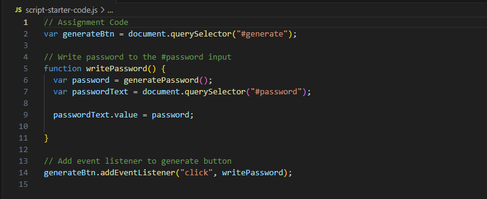

# Random Password Generator

## Description

---

This is a basic JavaScript application which will generate a random password, if a user's input meets the password criteria. 
I created pseudo-code to determine how best to create the application.   As I am very new to learning JavaScript, the complete JavaScript code structure differs from my initial pseudo-code as I initially thought to use arrays.  My commits are also a little messy as this is the first application that I have written without guidance.

**Issues I encountered & how I overcame them** 
```
 1. Adding chosen character type/s to an array to generate random password.   
 
    This was solved by using string values to hold the character types instead of arrays, then use the .concat() method to add each selected character type. I then tested this with console.log()

  2. Generating the password to the length chosen by the user. 

    I updated the for loop condition to be set at the user length, instead of the string of characters length.

  3. Validation of the password criteria was not working as expected when I tested in the browser.     

    I updated my code and added an IF statement to check if all criteria was NOT met, then exit the function and alert the user.  

  4. Previous user selections were not been cleared if the password generator was run multiple times in the browser.     

    On line 107, I updated the value of the variable which held user criteria selections to it's initial value of an empty string.
  ```

## Installation

---

No installation required. This application will run in the browser. 

## Usage

---

**This application has a dual use.**
1. Visit the deployed application //HERE// to generate a random password.
- When a user selects the **Generate Password** button they will be prompted with further instructions.
- To generate a password, certain criteria must be met from user input.  
- Password length to be at least 8 characters and no more than 128 characters.
- At least one of the following characters types must be selected to include in the password.
- lowercase, uppercase, numbers, special characters.
- The application must validate all of these conditions are met and then display the generated password on the screen.
- The application will alert a user if any of these conditions are not met.
The deployed application adapts to multiple screen sizes and has a responsive user interface.
The application has the following appearance and functionality.


2. The JavaScript starter code below, and the index.html and style.css code in the repository can be used as a starting point for anyone who is new to learning JavaScript and wanting to test your skills in completing the code to generate random passwords.
- The function generatePassword() needs to be declared.
- Adapt the functionality to suit your needs.

 

## Roadmap

---

Future features of this application include removing the pop-up boxes to use the application and implement a more user-friendly and appealing implementation of gathering the criteria for the password generator. I would also update the code so that if the criteria is not met the value "undefined" does not replace the placeholder text "Your Secure Password"

## Authors and Acknowledgment

---

I am the author of the functionality of the application to generate the random password.
I would like to acknowledge the Monash University Web Development Bootcamp which I am currently undertaking for providing the starter code and for my current stage of JavaScript abilities.

## License

---

MIT License. I am not currently seeking any additional contributions to this project.